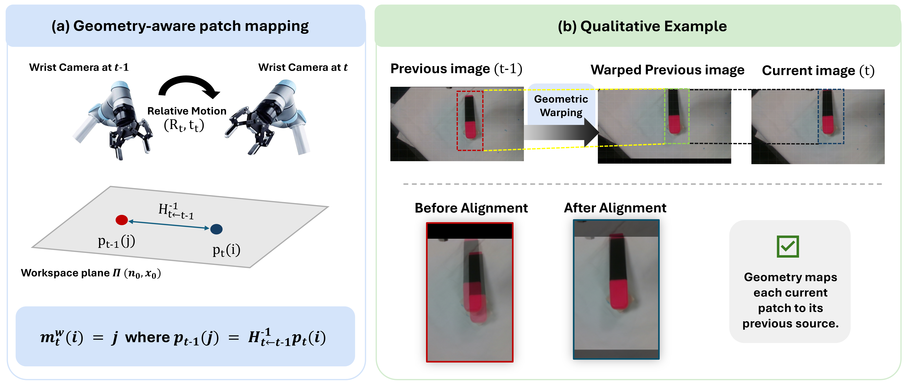
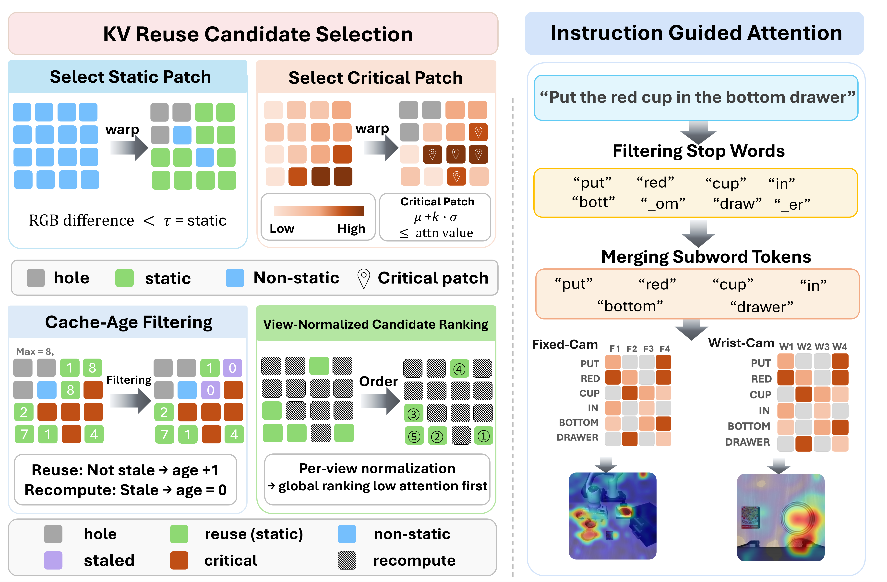

# Dynam-Cache

Official implementation of **Dynam-Cache: Geometry-Aware Temporal KV Reuse for Efficient Multi-View VLA Inference**.

Dynam-Cache is a training-free inference method that reduces VLA inference cost by selectively reusing visual KV states across consecutive observations. It is designed for multi-view manipulation with both fixed and moving wrist cameras.

This repository is built on [OpenVLA-OFT](https://github.com/moojink/openvla-oft) and evaluates Dynam-Cache on [LIBERO](https://github.com/Lifelong-Robot-Learning/LIBERO).

<p align="center">
  
</p>

<p align="center">
  <em>Overview of Dynam-Cache.</em>
</p>

### Demo
[https://github.com/unkown-user-180808/Dynam-Cache/blob/main/assets/demo/icra_2027_dynam_final.mp4](https://github.com/unkown-user-180808/Dynam-Cache/blob/main/assets/demo/dynam_cache_demo_preview.mp4)

## Overview

Dynam-Cache exploits temporal redundancy in multi-view robot observations while accounting for camera motion and task relevance.

The method combines:

- geometry-aware correspondence for the moving wrist camera,
- instruction-guided selection of reusable visual tokens,
- progressive KV reuse across transformer layers, and
- kinematics-guided reuse budgets for free motion and fine-grained manipulation.

Dynam-Cache is applied only at inference time and does not require retraining the VLA policy.

## Method Details

### Geometry-Aware Wrist-Camera Warping

For the moving wrist camera, Dynam-Cache establishes temporal correspondence across consecutive observations using geometry-aware warping, allowing visual KV states to be aligned before reuse.

<p align="center">
  
</p>

<p align="center">
  <em>Geometry-aware temporal correspondence for the moving wrist camera.</em>
</p>

### Reuse Candidate Selection

Dynam-Cache combines temporal visual similarity with instruction-guided attention to identify reusable visual tokens while protecting task-relevant regions.

<p align="center">
  
</p>

<p align="center">
  <em>Selection of safe visual KV reuse candidates.</em>
</p>

## Setup

### 1. OpenVLA-OFT

Follow the official [OpenVLA-OFT setup instructions](https://github.com/moojink/openvla-oft/blob/main/SETUP.md) to create the environment and install the required dependencies.

Dynam-Cache uses the same OpenVLA-OFT environment and pretrained policies.

### 2. LIBERO

Install [LIBERO](https://github.com/Lifelong-Robot-Learning/LIBERO) following the OpenVLA-OFT LIBERO setup instructions:

```bash
git clone https://github.com/Lifelong-Robot-Learning/LIBERO.git
pip install -e LIBERO
pip install -r experiments/robot/libero/libero_requirements.txt
```

### 3. Install the Dynam-Cache Transformers fork

Dynam-Cache modifies the LLaMA forward pass to support temporal KV reuse and progressive computation.

The modified Transformers implementation is included in this repository under:

```text
transformers_custom/
```

Install it into the same environment after completing the OpenVLA-OFT setup:

```bash
pip install -e ./transformers_custom
```

The main modified transformer file is:

```text
transformers_custom/src/transformers/models/llama/modeling_llama.py
```

You can verify that the Dynam-Cache version is being used with:

```bash
python - <<'PY'
import inspect
import transformers.models.llama.modeling_llama as llama

print(inspect.getfile(llama))
PY
```

The printed path should point to:

```text
Dynam-Cache/transformers_custom/src/transformers/models/llama/modeling_llama.py
```

## Checkpoints

Dynam-Cache does not require additional training.

Use the pretrained OpenVLA-OFT checkpoints provided in the official [OpenVLA-OFT LIBERO instructions](https://github.com/moojink/openvla-oft/blob/main/LIBERO.md).

Use the checkpoint corresponding to the LIBERO suite being evaluated.

## Evaluation

The main evaluation script is:

```text
experiments/robot/libero/run_libero_eval.py
```

Most evaluation settings are already configured with the defaults used by this repository.

For Dynam-Cache, specify the OpenVLA-OFT checkpoint and LIBERO suite:

```bash
python experiments/robot/libero/run_libero_eval.py \
  --pretrained_checkpoint moojink/openvla-7b-oft-finetuned-libero-spatial \
  --task_suite_name libero_spatial \
  --use_dynam_cache True
```

To run the OpenVLA-OFT baseline with the same setup:

```bash
python experiments/robot/libero/run_libero_eval.py \
  --pretrained_checkpoint moojink/openvla-7b-oft-finetuned-libero-spatial \
  --task_suite_name libero_spatial \
  --use_dynam_cache False
```

For other LIBERO suites, replace:

```text
--pretrained_checkpoint
--task_suite_name
```

with the corresponding checkpoint and suite name listed in the OpenVLA-OFT LIBERO instructions.

Additional options can be inspected with:

```bash
python experiments/robot/libero/run_libero_eval.py --help
```

For a fair comparison between OpenVLA-OFT and Dynam-Cache, use the same checkpoint and evaluation settings and change only `--use_dynam_cache`.

## Modified Files

Dynam-Cache mainly modifies the following components of the OpenVLA-OFT evaluation pipeline:

```text
experiments/robot/libero/run_libero_eval.py
experiments/robot/libero/warp_utils.py
experiments/robot/libero/attention_utils.py
experiments/robot/libero/cache_utils.py
experiments/robot/libero/kinematic_budget_utils.py
experiments/robot/openvla_utils.py
transformers_custom/src/transformers/models/llama/modeling_llama.py
```

The remaining OpenVLA-OFT and LIBERO infrastructure is kept unchanged unless required for integration.

## Acknowledgements

This repository builds on:

- [OpenVLA-OFT](https://github.com/moojink/openvla-oft)
- [LIBERO](https://github.com/Lifelong-Robot-Learning/LIBERO)

We thank the authors of these projects for releasing their code and models.

## Citation

If you use this code, please also cite the following works that this repository builds on.

### OpenVLA-OFT

```bibtex
@article{kim2025fine,
  title={Fine-Tuning Vision-Language-Action Models: Optimizing Speed and Success},
  author={Kim, Moo Jin and Finn, Chelsea and Liang, Percy},
  journal={arXiv preprint arXiv:2502.19645},
  year={2025}
}
```


### LIBERO

```bibtex
@article{liu2023libero,
  title={LIBERO: Benchmarking Knowledge Transfer for Lifelong Robot Learning},
  author={Liu, Bo and Zhu, Yifeng and Gao, Chongkai and Feng, Yihao and Liu, Qiang and Zhu, Yuke and Stone, Peter},
  journal={arXiv preprint arXiv:2306.03310},
  year={2023}
}
```

The citation for Dynam-Cache will be added upon publication.
